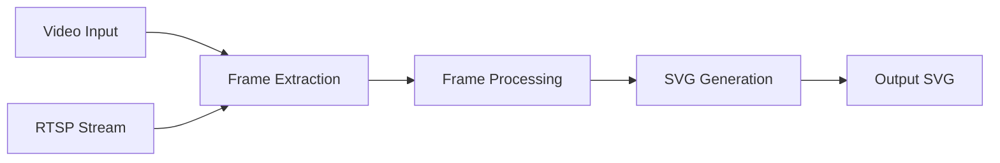

# 📚 Video-to-SVG Converter - Kompletna Dokumentacja

## 📋 Spis treści
1. [Wprowadzenie](#wprowadzenie)
2. [Instalacja](#instalacja)
3. [Architektura](#architektura)
4. [Użycie](#użycie)
5. [API Reference](#api-reference)
6. [Konfiguracja](#konfiguracja)
7. [Rozwiązywanie problemów](#rozwiązywanie-problemów)
8. [FAQ](#faq)

## 🎯 Wprowadzenie

### Opis projektu
Video-to-SVG Converter to narzędzie do konwersji plików wideo (MP4) oraz strumieni RTSP na animowane pliki SVG. Projekt umożliwia utworzenie pojedynczego pliku SVG zawierającego całą animację wideo.

### Główne funkcje
- ✅ Konwersja MP4 → animowany SVG
- ✅ Obsługa strumieni RTSP
- ✅ Konfigurowalny poziom kompresji
- ✅ Interfejs webowy
- ✅ REST API
- ✅ Konteneryzacja Docker

### Ograniczenia
- ⚠️ Duży rozmiar plików wyjściowych
- ⚠️ Utrata jakości przy wektoryzacji
- ⚠️ Ograniczona wydajność dla długich wideo

## 🔧 Instalacja

### Wymagania systemowe
- Python 3.9+
- Docker 20.10+ (opcjonalnie)
- FFmpeg
- 4GB RAM minimum
- 10GB wolnego miejsca na dysku

### Instalacja lokalna

```bash
# 1. Klonowanie repozytorium
git clone https://github.com/your-repo/video-to-svg
cd video-to-svg

# 2. Utworzenie środowiska wirtualnego
python -m venv venv
source venv/bin/activate  # Linux/Mac
# lub
venv\Scripts\activate  # Windows

# 3. Instalacja zależności
pip install -r requirements.txt

# 4. Instalacja FFmpeg
# Ubuntu/Debian
sudo apt-get update
sudo apt-get install ffmpeg

# macOS
brew install ffmpeg

# Windows
# Pobierz z https://ffmpeg.org/download.html
```

### Instalacja Docker

```bash
# 1. Budowanie obrazu
docker-compose build

# 2. Uruchomienie
docker-compose up -d

# 3. Sprawdzenie statusu
docker-compose ps
```

## 🏗️ Architektura

### Struktura projektu
```
video-to-svg/
├── src/                    # Kod źródłowy
│   ├── converter.py       # Główna logika konwersji
│   ├── frame_extractor.py # Ekstrakcja klatek
│   └── svg_builder.py     # Budowanie SVG
├── web/                   # Interfejs webowy
├── tests/                 # Testy jednostkowe
├── docker/                # Pliki Docker
└── config.yaml           # Konfiguracja
```

### Przepływ danych


### Komponenty

#### 1. **VideoToSVGConverter**
Główna klasa odpowiedzialna za orchestrację procesu konwersji.

```python
converter = VideoToSVGConverter(config)
converter.convert(input_path, output_path)
```

#### 2. **FrameExtractor**
Moduł odpowiedzialny za ekstrakcję klatek z wideo.

#### 3. **SVGBuilder**
Generator animowanych plików SVG z wykorzystaniem SMIL.

## 🚀 Użycie

### Interfejs CLI

```bash
# Podstawowa konwersja
python main.py input.mp4 output.svg

# Z konfiguracją
python main.py input.mp4 output.svg --config custom_config.yaml

# Strumień RTSP
python main.py rtsp://camera.local/stream output.svg

# Z dodatkowymi opcjami
python main.py input.mp4 output.svg \
    --fps 0.5 \
    --width 320 \
    --quality medium
```

### Interfejs webowy

1. Uruchom serwer:
```bash
python -m http.server 8000 --directory web
```

2. Otwórz przeglądarkę: `http://localhost:8000`

3. Prześlij plik lub podaj URL RTSP

### REST API

```bash
# Konwersja pliku
curl -X POST http://localhost:5000/api/convert \
  -H "Content-Type: application/json" \
  -d '{
    "input_file": "path/to/video.mp4",
    "output_file": "output.svg",
    "fps": 1,
    "quality": "medium"
  }'

# Sprawdzenie statusu
curl http://localhost:5000/api/status/job-123

# Konwersja RTSP
curl -X POST http://localhost:5000/api/rtsp/convert \
  -H "Content-Type: application/json" \
  -d '{
    "rtsp_url": "rtsp://camera.local/stream",
    "duration": 60,
    "output_file": "stream.svg"
  }'
```

### Python API

```python
from src.converter import VideoToSVGConverter
import yaml

# Wczytaj konfigurację
with open('config.yaml', 'r') as f:
    config = yaml.safe_load(f)

# Utwórz konwerter
converter = VideoToSVGConverter(config)

# Konwertuj plik
converter.convert('video.mp4', 'output.svg')

# Konwertuj z callbackiem postępu
def progress_callback(percent):
    print(f"Postęp: {percent}%")

converter.convert('video.mp4', 'output.svg', 
                 progress_callback=progress_callback)
```

## ⚙️ Konfiguracja

### Plik config.yaml

```yaml
# Ustawienia ekstrakcji klatek
extraction:
  frame_interval: 30      # Co która klatka (30 = 1fps dla 30fps video)
  start_time: 0          # Czas rozpoczęcia (sekundy)
  end_time: null         # Czas zakończenia (null = do końca)
  
# Ustawienia przetwarzania
processing:
  output_width: 640      # Szerokość wyjściowa
  output_height: 480     # Wysokość wyjściowa (null = zachowaj proporcje)
  compression_level: 8   # Kompresja PNG (0-9)
  color_mode: 'color'    # 'color', 'grayscale', 'monochrome'
  
# Ustawienia SVG
svg:
  output_fps: 1          # FPS animacji w SVG
  optimization: true     # Optymalizacja rozmiaru
  embed_method: 'base64' # 'base64' lub 'path' (wektoryzacja)
  animation_type: 'smil' # 'smil' lub 'css'
  
# Ustawienia zaawansowane
advanced:
  vectorize: false       # Wektoryzacja przez Potrace
  vectorize_threshold: 128  # Próg dla wektoryzacji
  max_file_size: 100    # Max rozmiar w MB (ostrzeżenie)
  use_cache: true       # Cache przetworzonych klatek
  parallel_processing: true  # Przetwarzanie równoległe
  num_workers: 4        # Liczba workerów
```

### Zmienne środowiskowe

```bash
# Ustawienia aplikacji
export VIDEO_SVG_PORT=5000
export VIDEO_SVG_HOST=0.0.0.0
export VIDEO_SVG_DEBUG=false

# Limity
export MAX_VIDEO_SIZE=1000  # MB
export MAX_DURATION=3600    # sekundy
export TEMP_DIR=/tmp/video-svg

# Docker
export DOCKER_INPUT_DIR=./input
export DOCKER_OUTPUT_DIR=./output
```

## 🔍 API Reference

### Klasy

#### VideoToSVGConverter

```python
class VideoToSVGConverter:
    """Główny konwerter video do SVG"""
    
    def __init__(self, config: dict):
        """
        Args:
            config: Słownik z konfiguracją
        """
    
    def convert(self, input_path: str, output_path: str, 
                progress_callback: Callable = None) -> dict:
        """
        Konwertuje video do SVG
        
        Args:
            input_path: Ścieżka do pliku wideo lub URL RTSP
            output_path: Ścieżka do pliku wyjściowego SVG
            progress_callback: Funkcja callback (opcjonalna)
            
        Returns:
            dict: Informacje o konwersji
            
        Raises:
            VideoNotFoundError: Gdy plik nie istnieje
            ConversionError: Gdy konwersja się nie powiedzie
        """
    
    def extract_frames(self, video_path: str) -> List[np.ndarray]:
        """Ekstraktuje klatki z wideo"""
    
    def process_frame(self, frame: np.ndarray) -> str:
        """Przetwarza pojedynczą klatkę do base64"""
    
    def build_svg(self, frames: List[str]) -> str:
        """Buduje animowany SVG z klatek"""
```

### Wyjątki

```python
class VideoToSVGError(Exception):
    """Bazowy wyjątek dla konwertera"""

class VideoNotFoundError(VideoToSVGError):
    """Gdy plik wideo nie został znaleziony"""

class ConversionError(VideoToSVGError):
    """Gdy konwersja się nie powiodła"""

class ConfigurationError(VideoToSVGError):
    """Gdy konfiguracja jest nieprawidłowa"""
```

### REST API Endpoints

#### POST /api/convert
Rozpoczyna konwersję wideo do SVG.

**Request:**
```json
{
  "input_file": "string",
  "output_file": "string",
  "config": {
    "fps": "number",
    "width": "number",
    "quality": "string"
  }
}
```

**Response:**
```json
{
  "job_id": "string",
  "status": "queued",
  "estimated_time": "number"
}
```

#### GET /api/status/{job_id}
Sprawdza status zadania konwersji.

**Response:**
```json
{
  "job_id": "string",
  "status": "processing|completed|failed",
  "progress": "number",
  "result": {
    "output_file": "string",
    "size": "number",
    "duration": "number"
  }
}
```

## 🛠️ Rozwiązywanie problemów

### Częste problemy

#### 1. **Brak pamięci podczas konwersji**
```bash
# Zwiększ limit pamięci Docker
docker-compose down
docker-compose up -d --memory="4g"

# Lub zmniejsz rozdzielczość w config.yaml
output_width: 320
output_height: 240
```

#### 2. **Błąd: "FFmpeg not found"**
```bash
# Sprawdź instalację
ffmpeg -version

# Jeśli brak, zainstaluj ponownie
sudo apt-get install --reinstall ffmpeg
```

#### 3. **Duży rozmiar pliku SVG**
```yaml
# Zmień ustawienia w config.yaml
extraction:
  frame_interval: 60  # Mniej klatek
processing:
  compression_level: 9  # Max kompresja
svg:
  optimization: true
```

#### 4. **Problemy z RTSP**
```python
# Dodaj timeout i retry
converter = VideoToSVGConverter(config)
converter.rtsp_timeout = 10
converter.rtsp_retries = 3
```

### Logi i debugging

```bash
# Włącz tryb debug
export VIDEO_SVG_DEBUG=true
python main.py input.mp4 output.svg --verbose

# Sprawdź logi Docker
docker-compose logs -f converter

# Logi w określonym miejscu
python main.py input.mp4 output.svg --log-file conversion.log
```

## ❓ FAQ

### Q: Jak zmniejszyć rozmiar pliku SVG?
**A:** Możesz:
- Zwiększyć `frame_interval` (mniej klatek)
- Zmniejszyć rozdzielczość (`output_width`)
- Włączyć wektoryzację (`vectorize: true`)
- Użyć trybu monochromatycznego (`color_mode: 'monochrome'`)

### Q: Czy mogę konwertować tylko fragment wideo?
**A:** Tak, użyj parametrów `start_time` i `end_time`:
```yaml
extraction:
  start_time: 10   # Od 10 sekundy
  end_time: 30     # Do 30 sekundy
```

### Q: Jak obsłużyć duże pliki wideo?
**A:** Rekomendacje:
- Użyj trybu streaming (przetwarzanie po kawałku)
- Włącz cache (`use_cache: true`)
- Zwiększ pamięć Docker
- Rozważ podział na segmenty

### Q: Czy SVG będzie działać w każdej przeglądarce?
**A:** Animacje SMIL są wspierane przez większość przeglądarek oprócz IE. Dla pełnej kompatybilności użyj `animation_type: 'css'`.

### Q: Jak dodać własne filtry do klatek?
**A:** Możesz rozszerzyć klasę `VideoToSVGConverter`:
```python
class CustomConverter(VideoToSVGConverter):
    def process_frame(self, frame):
        # Twój filtr
        frame = cv2.GaussianBlur(frame, (5, 5), 0)
        return super().process_frame(frame)
```

## 📞 Wsparcie

- **Issues:** [GitHub Issues](https://github.com/your-repo/issues)
- **Email:** support@example.com
- **Dokumentacja:** [Wiki](https://github.com/your-repo/wiki)

## 📄 Licencja

Ten projekt jest licencjonowany na podstawie licencji MIT. Zobacz plik [LICENSE](LICENSE) dla szczegółów.

## ⚠️ Ważne uwagi techniczne

1. **Wydajność** – Renderowanie dużych SVG w przeglądarce może być wolne i zużywać dużo pamięci.
2. **Kompatybilność** – Animacje SMIL nie działają w niektórych przeglądarkach (np. IE/Edge Legacy).
3. **RTSP** – Strumienie na żywo generują ogromne pliki jeśli nie ograniczymy czasu nagrywania.

## 🎯 Rekomendacje

- **Alternatywy:**
  - HLS/DASH streaming
  - Canvas API
  - WebM z alpha channel
- **Optymalizacje:**
  - Redukcja liczby klatek (`frame_interval`)
  - Zmniejszenie rozdzielczości (`output_width`)
  - Kompresja PNG (`compression_level`)
  - Ograniczenie czasu trwania (`start_time`, `end_time`)

### Przykładowa konfiguracja YAML dla małych plików
```yaml
extraction:
  frame_interval: 60
processing:
  output_width: 320
  color_mode: 'grayscale'
svg:
  optimization: true
```

## 📈 Przykłady użycia

- Krótkie animacje (< 10s)
- Ikony i logo animowane
- Prezentacje z małą liczbą klatek
- Podglądy wideo

## Ograniczenia
- Najlepiej sprawdza się dla krótkich, prostych animacji
- Pliki SVG mogą być bardzo duże dla długich/dużych wideo
- Nie wszystkie przeglądarki wspierają animacje SMIL

## Autor: [Twoje Imię]